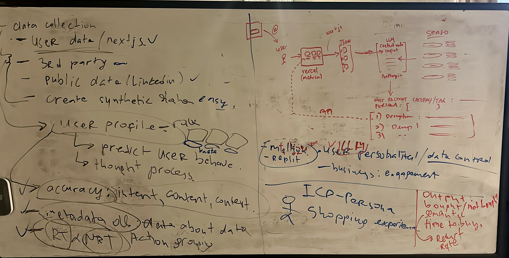

# 1024-o1



### Description
A brief introduction to your project, explaining what it does, its purpose, and the problem it solves.

### Table of Contents
- [Installation](#installation)
- [Usage](#usage)
- [Features](#features)
- [Contributing](#contributing)
- [License](#license)

### Installation

1. Clone the repository:

    ```bash
    git clone https://github.com/sakomws/1024-o1.git
    ```

2. Navigate to the project directory:

    ```bash
    cd 1024-o1-storefront
    yarn install
    yarn dev
    ```
    ```
    Storefront admin:
    ```
    cd 1024-o1-admin
    yarn install
    yarn dev
    ```

    ```
    cd 1024-o1-admin
    pip install -r requirements.txt
    python main.py
    ```

3. Install dependencies:

    ```bash
    npm install
    # or
    pip install -r requirements.txt
    ```

4. Set up the environment (if applicable):

    ```bash
    cp .env.example .env
    ```

    Update `.env` with the required configuration.

### Usage

1. Run the project:

    ```bash
    npm start
    # or
    python app.py
    ```

2. Open your browser and navigate to `http://localhost:` (or the port specified in the project).

### Features

- 

### Contributing

Contributions are welcome! Please follow these steps to contribute:

1. Fork the repository.
2. Create a new branch for your feature (`git checkout -b feature-name`).
3. Commit your changes (`git commit -m 'Add feature'`).
4. Push to the branch (`git push origin feature-name`).
5. Create a pull request.

### License

This project is licensed under the MIT License. See the [LICENSE](LICENSE) file for details.
